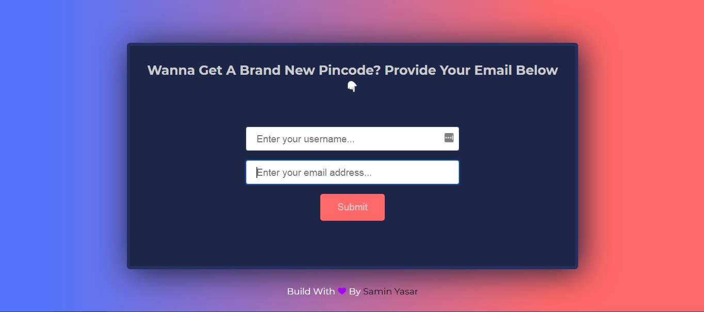

## **Hey, there**

Here I created a simple pincode generator project using JavaScript.

[](https://saminyasar.netlify.app/)
[](https://www.facebook.com/saminyasar004/)
[](https://www.facebook.com/saminyasar04/)
[](https://instagram.com/saminyasar004/)
[](https://twitter.com/saminyasar004/)
[](https://stackoverflow.com/users/14735945/samin-yasar)
[](https://github.com/saminyasar004/)



### **Technologies**

Technologies used in this Project mentioned below:

```
1. HTML5
2. CSS3
3. Vanilla JavaScript
4. Netlify
```

## **Feautures**

```
1. User input authentication.
2. If the user entered a valid username and email address then a Pincode will generate and gone into his email so that he enter it here correctly.
3. Timer functionality included.
```

### **Live Site Link**

[Pincode Generator](https://pincode-generator.netlify.app/)

### **Happy Coding 🚀**
